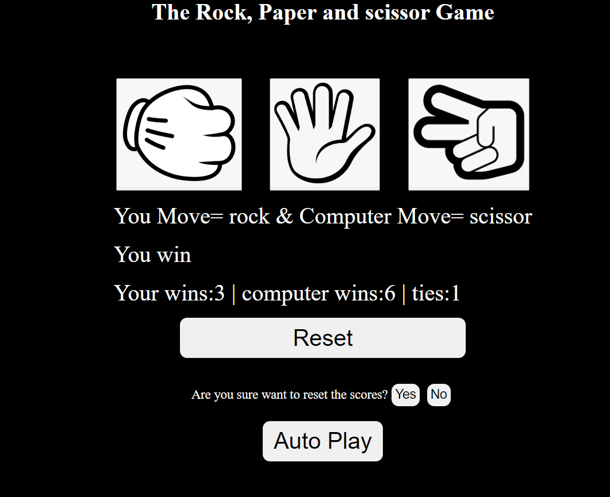

# ✊✋✌️ Rock-Paper-Scissors Game

Welcome to the **Rock-Paper-Scissors** game, a fun and interactive web-based game built using **HTML**, **CSS**, and **JavaScript**! 🎮

## 🌟 Features
- **Local Storage**: Stores the game scores even when the page is refreshed or revisited.
- **Keyboard Shortcuts**:
  - Press **`r`** for ✊ (Rock).
  - Press **`p`** for ✋ (Paper).
  - Press **`s`** for ✌️ (Scissors).
  - Press **`a`** to activate the Auto Play feature 🤖.
  - Press **`Backspace`** to reset the scores 🔄.

## 🎯 How to Play
1. **Choose your move**: You can either click the buttons or use the keyboard shortcuts (`r`, `p`, `s`).
2. **Auto Play**: Let the game play automatically by pressing the **`a`** key.
3. **Reset Scores**: Want to start fresh? Press **Backspace** to reset the score. A confirmation will be displayed before proceeding.
   
## 🛠️ Technologies Used
- **HTML**: For the structure of the game.
- **CSS**: For styling the game interface.
- **JavaScript**: For game logic and user interaction.
- **Local Storage**: To store and persist the game scores.

## 📸 Screenshots

